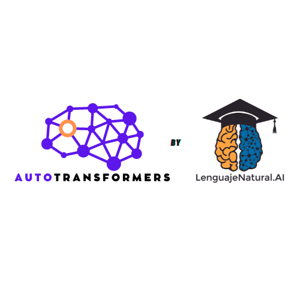
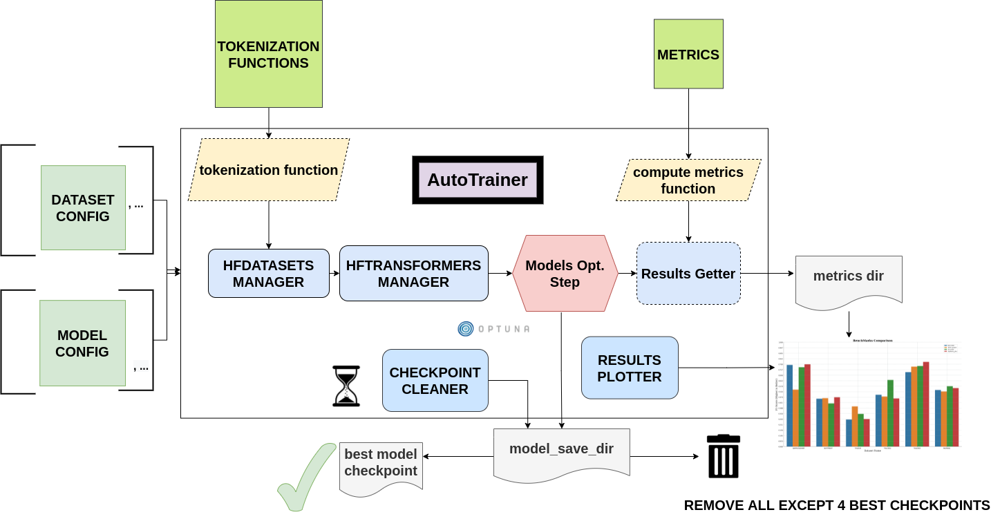

# AUTOTRANSFORMERS: A library for automatic training and comparison of Language Models.



`autotransformers` is useful for training multiple transformer-like models for a bunch of datasets in one go, without writing much code or using too much time (the machine does the effort, not you). It is highly integrated with HuggingFace libraries: Transformers, PEFT, TRL, Datasets and Evaluate.

Please check the [online documentation](https://lenguajenatural-ai.github.io/autotransformers/autotransformers.html) for a more complete overview of the library.

The main functionality of `autotransformers` is depicted in the following figure, where the dashed lines represent fully customizable modules:




The main class in `autotransformers` is `AutoTrainer`, which is configured with a list of `DatasetConfig`s and a list of `ModelConfig`s. Then, `AutoTrainer` will loop through each dataset configuration, performing hyperparameter tuning for each of the models configurations. For that, it uses `HFDatasetsManager` to load the dataset, depending on the configuration of `DatasetConfig`. It will also tokenize the dataset accordingly. As the dashed lines show, the user can use the default `tokenization_function` for the desired task, or can define their own in `DatasetConfig`. Then, `HFTransformersManager` will load all necessary Transformer objects (model, data collator, training arguments, trainer...). After that, hyperparameter tuning is performed with Optuna. A `CkptCleaner` (checkpoint cleaner) class removes bad performing checkpoints every 10 minutes, also saving the best performing checkpoint in the experiment in a separate directory. After hyperparameter tuning, results on the test split (if available, otherwise the validation split) are obtained via `ResultsGetter`, which is customizable (by passing a custom ResultsGetter class overriding the current methods), and uses a `compute_metrics_function` which is also customizable, by passing a `custom_eval_func` to `DatasetConfig`. These results are stored in json or, if json saving fails, in txt format (results in txt can be also easily loaded with `ast.literal_eval`). `ResultsPlotter` is a helper class that enables the user to easily get a plot of the models' performance on each dataset, and their average performance. 

## WHY USE autotransformers?

The main advantages you will find when using autotransformers are the following:

* |:high_brightness:| You can easily train multiple models on multiple datasets, sequentially, with hyperparameter tuning. This eases the task of finding the best model for each task, by comparing multiple models with different parameter configurations. Optuna is used for hyperparameter search.

* |:hourglass:| Once you get used to the library and how scripts are configured, writing a new script for any task belonging to QA, NER, Classification (in any of its forms), or Seq2Seq, will take minutes.

* |:floppy_disk:| To avoid disk overloading, AutoTrainer, the main class in autotransformers, comes with a checkpoint cleaner, which removes every 10 minutes all checkpoints but the four best (excluding the current optuna run to avoid errors). Additionally, a directory with the best checkpoint found (using validation metrics) is saved each time checkpoints are cleaned. This saves not only disk usage, but effort, easing the task of finding the best checkpoint and removing all unnecessary checkpoints. This is also useful if you want to run many models for many trials on many datasets while you go to a music festival |:sunglasses:| (tested). In that situation you don't want to worry about whether your disk is full before your experiments finish.

* |:tokyo_tower:| autotransformers comes with a tool to easily integrate NLP data augmentation methods from [nlpaug](https://github.com/makcedward/nlpaug/) library. Keep reading to learn how.

* |:bar_chart:| Metrics on test after hyperparameter tuning are saved in a directory defined when initializing AutoTrainer. Additionally, with ResultsPlotter you can easily generate a beautiful graph depicting the comparison of the different models you have trained for a dataset. This is handy for presenting a models' comparison in a visual way.

* |:palm_tree:| autotransformers is flexible, so when you get a deep understanding of the tool, you will be able to train ensembles of transformers or other monsters of nature. Simpler architectures like pre-trained Transformers models plus LSTMs or other type of layers before the task layers are also possible. This speeds up the research process, as the user only needs to create a custom class inheriting from transformers.PretrainedModel and configure ModelConfig and DatasetConfig accordingly; the rest is done by AutoTrainer. The same applies to artificial Encoder-Decoder models (that is encoder-decoder models created from pre-trained encoder-only or decoder-only models) - check [this](https://huggingface.co/docs/transformers/model_doc/encoder-decoder) for more information. EncoderDecoderModel architecture can be configured for seq2seq tasks by setting the correct ModelConfig's parameters. This is useful for seq2seq tasks on languages for which there is no Encoder-Decoder model available.

## INSTALLATION AND TESTING

To install `autotransformers` from pypi, you can simply run:

```
pip install autotransformers
```

Alternatively, to install the most recent version from source, you can directly install it from GitHub:

```
pip install git+https://github.com/lenguajenatural-ai/autotransformers.git
```

If you prefer to have a local copy of the library, in case you want to customize any part of it or for whatever reason, you can install it from the local repository in editable mode, like this:

```
git clone https://github.com/lenguajenatural-ai/autotransformers.git
cd autotransformers
pip install -e .
```

Be aware that pytorch must be built on a cuda version that is compatible with the machine's installed cuda version. In case pytorch's default cuda version is not compatible visit https://pytorch.org/get-started/locally/ and install a compatible pytorch version.

You can run tests after installing the library with `pytest`. It is already installed when installing `autotransformers`. Inside the main `autotransformers` repository directory (where README is), run:

```
pytest .
```

## SUPPORTED TASKS

Here is a list of the tasks supported by `autotransformers`.

### ChatBots / Instruction-Tuning

Now you can train chatbots and instructional models with `autotransformers`, by using `task=chatbot` in `DatasetConfig`.

### Binary or Multi-Class Classification

Binary or multi-class classification is supported under the task name `classification`. So, for training models for this task, you just need to set in your DatasetConfig `task="classification"`. 

### Multi-Label Classification

Multi-label classification is also under the task name `classification`. However, the user must add `is_multilabel=True` and `config_num_labels=<num_labels_multilabel>` to DatasetConfig. For multi-label classification, `AutoTrainer`, the main class in `autotransformers`, expects a dataset with a text field and the rest of the fields must be labels. If your dataset does not come in this format initially, you can either process your dataset outside of `AutoTrainer` and then pass a DatasetConfig with the processed dataset in the correct format, or you can define a `pre_func` to pass to `DatasetCOnfig` that will do that preprocessing. You can find an example of how to do this under the `notebooks/classification` folder, in the script called `train_multilabel.py`. 

For multi-label tasks, we can define a probability threshold for labels to be positive, as each label is independent of the rest. However, defining this threshold can be tricky, and is not straightforward. For that reason, when computing the metrics for multilabel, we iterate over thresholds from 0.1 to 0.9, with 0.1 step size. Then, we return the metrics belonging to the threshold which scored highest, together with that threshold. This way, the user already knows which probability threshold to use when using the returned model in production.

### Named Entity Recognition (NER)

The task name for NER is `ner`, so inside DatasetConfig, the user must pass `task="ner"`. AutoTrainer expects two fields: a list of tokens (`token_list`) and a list of labels (`label_list`) for each data instance. If your dataset is not already in that format, which is the most common case, you can easily process your dataset with a `pre_func`, using `autotransformers.utils.dict_to_list` function. You can check an example of how to do this in the script `notebooks/NER/train_spanish_ner.py`. In that script, `ehealth_kd` dataset does not have that format by default, so `pre_func=dict_to_list` is added to `DatasetConfig` to preprocess data before tokenizing it.

### Extractive Question Answering (QA)

The task name for QA is `qa`, so the correct configuration is `DatasetConfig(..., task="qa")`. The default format for this task is the SQUAD format (check [squad dataset in Huggingface's Datasets](https://huggingface.co/datasets/squad)). If your QA dataset is not in that format, you can either preprocess it before using `AutoTrainer` with it, or use a `pre_func` in `DatasetConfig` to achieve the same.

### Seq2Seq

Seq2Seq involves many different subtasks, such as translation, summarization, generative question answering... `AutoTrainer` is suited to perform any of these, as they all are based on generating a target text from a source text. The task name in `autotransformers` is `seq2seq`, so the configuration would be `DatasetConfig(..., task="seq2seq")`. You can find an example on how to train models on a seq2seq task in `notebooks/seq2seq/train_summarization_mlsum.py` script.


## RELEVANT PUBLIC PROJECTS USING autotransformers

Here is a list of public projects that have used `autotransformers` as its main tool for training models:

1. `BioMedIA`: The winning project of [SomosNLP Hackaton](https://huggingface.co/hackathon-pln-es). It was also presented at NAACL2022, obtaining the Best Poster Presentation Award. You can check the paper [here](https://research.latinxinai.org/papers/naacl/2022/pdf/paper_06.pdf).

2. `Detecting and Classifying Sexism by Ensembling Transformers Models`. This work was presented as part of IberLEF2022@Sepln2022 Conference. In the [results page of the workshop](http://nlp.uned.es/exist2022/#results) you can check that the systems produced by this paper achieved highest on both tasks of the workshop. Link to the paper [here](https://ceur-ws.org/Vol-3202/exist-paper3.pdf).

3. `Named Entity Recognition For Humans and Species With Domain-Specific and Domain-Adapted Transformer Models`. This work was presented as part of IberLEF2022@Sepln2022 Conference. Link to the paper [here](https://ceur-ws.org/Vol-3202/livingner-paper9.pdf).

4. Adversarial Question Answering in Spanish with Transformer Models. This work was presented as part of IberLEF2022@Sepln2022 Conference. Link to the paper [here](https://ceur-ws.org/Vol-3202/quales-paper3.pdf).

5. Extractive and Abstractive Summarization Methods for Financial Narrative Summarization in English, Spanish and Greek. . This work was presented as part of FNP@LREC2022 Conference. Link to the paper [here](https://aclanthology.org/2022.fnp-1.8.pdf).

## MODULES

The library is composed mainly of 3 important objects: the ModelConfig, DatasetConfig, and AutoTrainer. The two first are useful for configuring the experiments in a user-friendly way; both of them are dataclasses. AutoTrainer, on the other hand, serves for optimizing the models with the configurations passed to it. It uses Optuna in the background to optimize the models' parameters, which are passed in the ModelConfig.

### ModelConfig

The ModelConfig class allows to configure each of the models' configurations. For a full list and description of all arguments of ModelConfig, please check the documentation.

There are some examples in the following lines on how to instantiate a class of this type for different kind of models.

- Example 1: instantiate a roberta large with a given hyperparameter space to save it under the name bsc@roberta-large, in a directory "/prueba/". We are going to run 20 trials, the first 8 of them will be random.

```python
from autotransformers import ModelConfig

def hp_space(trial):
    return {
        "learning_rate": trial.suggest_float(
            "learning_rate", 1e-5, 5e-5, log=True
        ),
        "num_train_epochs": trial.suggest_categorical(
            "num_train_epochs", [5, 10, 15, 20]
        ),
        "per_device_train_batch_size": trial.suggest_categorical(
            "per_device_train_batch_size", [8]),
        "per_device_eval_batch_size": trial.suggest_categorical(
            "per_device_eval_batch_size", [16]),
        "gradient_accumulation_steps": trial.suggest_categorical(
            "gradient_accumulation_steps", [2, 4, 8, 16]),
        "warmup_ratio": trial.suggest_float(
            "warmup_ratio", 0.1, 0.10, log=True
        ),
        "weight_decay": trial.suggest_float(
            "weight_decay", 1e-2, 0.1, log=True
        ),
        "adam_epsilon": trial.suggest_float(
            "adam_epsilon", 1e-10, 1e-6, log=True
        ),
    }

bsc_large_config = ModelConfig(
        name="PlanTL-GOB-ES/roberta-large-bne",
        save_name="bsc@roberta-large",
        hp_space=hp_space,
        save_dir="./test_trial/",
        n_trials=20, # number of optuna trials to run for optimizing hyperparameters.
        random_init_trials=8, # number of optuna random init trials (before the optimization algorithm drives the search)
        dropout_vals=[0.0], # dropout values for last layer to use.
        only_test=False, # whether to only test on test dataset (no prev train)
    )
```

Example 2: if the model we are configuring is aimed at doing a seq2seq task, we could configure it like this:

```python
from transformers import Seq2SeqTrainer, MT5ForConditionalGeneration

def tokenize_dataset(examples, tokenizer, dataset_config):
    inputs = ["question: {} context: {}".format(q, c) for q, c in zip(examples["question"], examples["context"])]
    targets = examples[dataset_config.label_col]
    model_inputs = tokenizer(inputs, max_length=1024 if tokenizer.model_max_length != 512 else 512, truncation=True)

    # Setup the tokenizer for targets
    with tokenizer.as_target_tokenizer():
        labels = tokenizer(targets, max_length=dataset_config.max_length_summary, padding=True, truncation=True)

    labels["input_ids"] = [
        [(l if l != tokenizer.pad_token_id else -100) for l in label] for label in labels["input_ids"]
    ]

    model_inputs["labels"] = labels["input_ids"]
    return model_inputs

mt5_config = ModelConfig(
         name="google/mt5-base",
         save_name="mt5-base",
         hp_space=hp_space,
         num_beams=4,
         trainer_cls_summarization=Seq2SeqTrainer,
         model_cls_summarization=MT5ForConditionalGeneration,
         custom_tok_func=tokenize_dataset,
         only_test=False,
         **{
            "min_length_summary": 64,
            "max_length_summary": 360,
            "random_init_trials": 3,
            "n_trials": 1,
            "save_dir": "./example_seq2seq/"
         }
)
```

### DatasetConfig

Next we have the DatasetConfig class, aimed at configuring all the specifications of a dataset: the fields where data is located, how to process it, what kind of task it is, etc. For a full list of the parameters, please check the online documentation.


Here we will see different examples of how to create a DatasetConfig for different tasks. There are certain objects that are used in all the examples:

```python
fixed_train_args = {
        "evaluation_strategy": "steps",
        "num_train_epochs": 10,
        "do_train": True,
        "do_eval": True,
        "logging_strategy": "steps",
        "eval_steps": 1,
        "save_steps": 1,
        "logging_steps": 1,
        "save_strategy": "steps",
        "save_total_limit": 2,
        "seed": 69,
        "fp16": False,
        "no_cuda": True,
        "dataloader_num_workers": 2,
        "load_best_model_at_end": True,
        "per_device_eval_batch_size": 16,
        "adam_epsilon": 1e-6,
        "adam_beta1": 0.9,
        "adam_beta2": 0.999,
        "max_steps": 1
    }

```

* Example 1: Create a config for Conll2002 dataset, loading it from the Hub:

```python
from transformers import EarlyStoppingCallback
from autotransformers import DatasetConfig


conll2002_config = {
    "seed": 44,
    "direction_optimize": "maximize", # whether to maximize or minimize the metric_optimize.
    "metric_optimize": "eval_f1-score", # metric to optimize; must be returned by compute_metrics_func
    "callbacks": [EarlyStoppingCallback(1, 0.00001)], # callbacks
    "fixed_training_args": fixed_train_args, # fixed train args defined before
    "dataset_name": "conll2002", # the name for the dataset
    "alias": "conll2002", # the alias for our dataset
    "task": "ner", # the type of tasl
    "hf_load_kwargs": {"path": "conll2002", "name": "es"}, # this are the arguments we should pass to datasets.load_dataset
    "label_col": "ner_tags", # in this column we have the tags in list of labels format. 
}

conll2002_config = DatasetConfig(**conll2002_config) # Now we have it ready for training with AutoTrainer !

```

* Example 2: Create a config for MLSUM dataset (for summarization)

```python
from transformers import EarlyStoppingCallback
from autotransformers import DatasetConfig

mlsum_config = {
        "seed": 44,
        "direction_optimize": "maximize",
        "metric_optimize": "eval_rouge2",
        "callbacks": [EarlyStoppingCallback(1, 0.00001)],
        "fixed_training_args": fixed_train_args,
        "dataset_name": "mlsum",
        "alias": "mlsum",
        "retrain_at_end": False,
        "task": "summarization",
        "hf_load_kwargs": {"path": "mlsum", "name": "es"},
        "label_col": "summary",
        "num_proc": 16
    }

mlsum_config = DatasetConfig(**mlsum_config)
```

* Example 3: Create a config for a NER task which is in json format.

```python
from transformers import EarlyStoppingCallback
from autotransformers import DatasetConfig, joinpaths

data_dir = "/home/loquesea/livingnerdata/"

livingner1_config = {
    "seed": 44,
    "direction_optimize": "maximize",
    "metric_optimize": "eval_f1-score",
    "callbacks": [EarlyStoppingCallback(1, 0.00001)],
    "fixed_training_args": fixed_train_args,
    "dataset_name": "task1-complete@livingner",
    "alias": "task1-complete@livingner",
    "task": "ner",
    "split": False,
    "label_col": "ner_tags", # in this field of each json dict labels are located.
    "text_field": "token_list", # in this field of each json dict the tokens are located
    "files": {"train": joinpaths(data_dir, "task1_train_complete.json"),
            "validation": joinpaths(data_dir, "task1_val_complete.json"),
            "test": joinpaths(data_dir, "task1_val_complete.json")
    }
}
# these jsons must come in the form:
# {
# 'data': [
#       {"token_list": [], "label_list": []},
#   ]
# }

livingner1_config = DatasetConfig(**livingner1_config)
```

You can refer to the examples folder to see more ways of using DatasetConfig, as well as to understand the functionalities of it that are specific to a certain task.

### AutoTrainer

AutoTrainer is the main class in `autotransformers`, but is almost purely configured via lists of `DatasetConfig` and `ModelConfig`. The full configuration of AutoTrainer, given that you already have a `DatasetConfig` and a `ModelConfig`, would be the following:

```python
from autotransformers import AutoTrainer

autotrainer = AutoTrainer(
    dataset_configs=[dataset_config],
    model_configs=[model_config],
    metrics_dir="experiments_metrics",
    hp_search_mode="optuna",
    clean=True,
    metrics_cleaner="tmp_metrics_cleaner",
    use_auth_token=True,
)
all_results = autotrainer()
```

## ADDITIONAL TOOLS

### NLPAugPipeline

This is a pipeline for data augmentation. With this, you can easily integrate [nlpaug](https://github.com/makcedward/nlpaug/) into your datasets from Huggingface, in an easy way. Below there is an example of how to build a pipeline that will be applied over the dataset with different data augmentation methods.
In the below example, 10% of the examples are augmented with contextual word embeddings in inserting mode (that is, a word from the language model is inserted somewhere in the text); 15% are augmented with the same type of augmenter but substituting the words instead of inserting them. Moreover, we also use a backtranslation augmenter over 20% of the examples, translating them to german and then back to english.
If you want more information on how to use and configure each of these augmenters, just check [this notebook](https://github.com/makcedward/nlpaug/blob/master/example/textual_augmenter.ipynb).

```python
from datasets import load_dataset
from autotransformers.augmentation import NLPAugPipeline, NLPAugConfig

dataset = load_dataset("ade_corpus_v2", "Ade_corpus_v2_classification")

dataset = dataset["train"].select(range(100))

steps = [
    NLPAugConfig(name="contextual_w_e", proportion=0.1, aug_kwargs={"model_path": "bert-base-cased", "action": "insert", "device":"cuda"}),
    NLPAugConfig(name="contextual_w_e", proportion=0.15, aug_kwargs={"model_path": "bert-base-cased", "action": "substitute", "device": "cuda"}),
    NLPAugConfig(
        name="backtranslation", proportion=0.2, aug_kwargs={"from_model_name": "facebook/wmt19-en-de", "to_model_name": "facebook/wmt19-de-en"}
    ),
]
aug_pipeline = NLPAugPipeline(steps=steps)
augmented_dataset = dataset.map(aug_pipeline.augment, batched=True)
```

It is already integrated with AutoTrainer via the DatasetConfig, as shown below.

```python
from autotransformers import DatasetConfig, ModelConfig, AutoTrainer
from autotransformers.augmentation import NLPAugConfig
from autotransformers.default_param_spaces import hp_space_base

augment_steps = [
    NLPAugConfig(name="contextual_w_e", proportion=0.3, aug_kwargs={"model_path": "bert-base-cased", "action": "insert", "device":"cuda"}),
    NLPAugConfig(name="contextual_w_e", proportion=0.3, aug_kwargs={"model_path": "bert-base-cased", "action": "substitute", "device": "cuda"}),
    NLPAugConfig(
        name="backtranslation", proportion=0.3, aug_kwargs={"from_model_name": "Helsinki-NLP/opus-mt-es-en", "to_model_name": "Helsinki-NLP/opus-mt-en-es", "device": "cuda"}
    ),
]

data_config = DatasetConfig(
    **{
        "hf_load_kwargs": {"path": "ade_corpus_v2", "name": "Ade_corpus_v2_classification"},
        "task": "classification",
        # we would put many other parameters here.
        "augment_data": True,
        "data_augmentation_steps": augment_steps
    }
)

# now we can create a model and train it over this dataset with data augmentation.

model_config = ModelConfig(
    name="bert-base-uncased",
    save_name="bert_prueba",
    hp_space = hp_space_base, # we would have to define this object before.
    n_trials=10,
    random_init_trials=5
)

autotrainer = AutoTrainer(
    model_configs = [model_config],
    dataset_configs = [data_config]
)

autotrainer()
```

In this way, we are using the pipeline to internally augment data before training, therefore we will increment the amount of training data, without modifying the validation and test subsets.

## Citation

```
@misc{vaca2024autotransformers,
    author = {Alejandro Vaca Serrano},
    title = {AutoTransformers: A Library for Automatic Training and Benchmarking of Transformer Models},
    year = {2024},
    howpublished = {\url{https://github.com/lenguajenatural-ai/autotransformers}},
}
```
